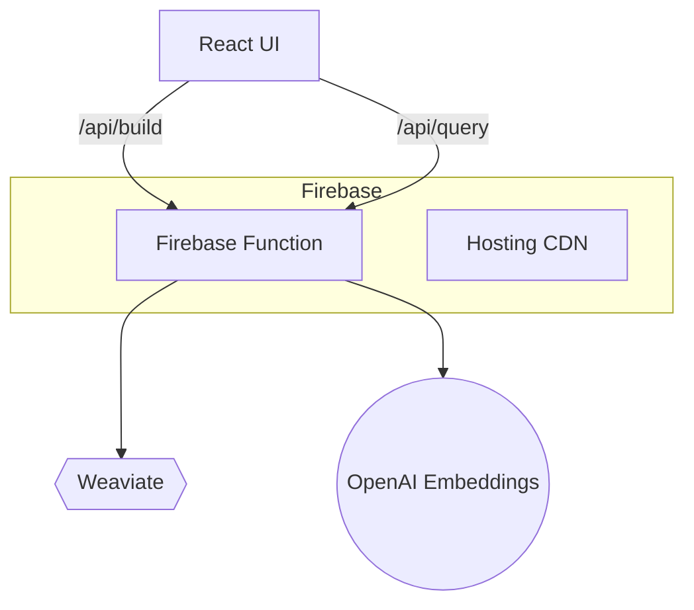

# Drag‑and‑Drop RAG App


A **turn‑key, production‑ready Retrieval‑Augmented Generation (RAG) pipeline builder**. Upload your documents, press **Build RAG**, and instantly get a secure API endpoint backed by **Weaviate** and **OpenAI** — all deployable to **Firebase Hosting & Cloud Functions** with a single command.

> **Highlights**
> * Modern front‑end: **React 19**, **Vite 6**, **Tailwind 4**, **shadcn/ui** primitives, **lucide‑react** icons.
> * Vector store: **Weaviate 1.29+** (local Docker or Weaviate Cloud Service).
> * Serverless back‑end: **Express 4** running in **Firebase Functions (Node 20)**.
> * End‑to‑end security: Shared `X‑API‑KEY` header + optional Firebase Auth.
> * One‑command workflows via **Makefile** + **Docker Compose**.


---

## Table of Contents
1. [Architecture](#architecture)
2. [Repository Structure](#repository-structure)
3. [Prerequisites](#prerequisites)
4. [Local Development](#local-development)
5. [Environment Variables](#environment-variables)
6. [Build & Deploy](#build--deploy)
7. [Security](#security)
8. [Troubleshooting](#troubleshooting)
9. [License](#license)

---

## Architecture

* **React UI** handles drag‑and‑drop uploads, config, and progress.
* **Firebase Function (`functions/index.js`)** receives files, splits & embeds text with OpenAI, then stores vectors in **Weaviate**.
* A `/api/query` endpoint performs semantic search + returns the top‑k matches.

---

## Repository Structure
```text
rag-dnd-app/
├── client/            # React 19 front‑end (Vite 6)
├── functions/         # Cloud Functions (Express API)
├── docker-compose.yml # Local Weaviate service
├── Makefile           # Quality‑of‑life commands
├── firebase.json      # Hosting + Functions rewrite config
├── .firebaserc        # Firebase project alias
├── .env.example       # Sample env vars
└── README.md          # You are here
```

---

## Prerequisites
| Tool | Minimum Version | Purpose |
|------|-----------------|---------|
| **Node.js** | 20 LTS | Front‑end + Functions runtime |
| **npm** | 10 | Package manager & Firebase CLI dependency |
| **Docker Desktop** | 4.x | Local Weaviate container |
| **Firebase CLI** | 14.x | Deploy & emulate Hosting/Functions |
| **OpenAI API key** | n/a | Embeddings generation |
| **Git** | any | Clone & version control |

> **Optional:** VS Code + *Firebase Tools* extension for GUI‑driven deploys/logs.

---

## Local Development
```bash
# 1 · clone & install deps
$ git clone https://github.com/your‑org/rag-dnd-app.git && cd rag-dnd-app
$ make setup

# 2 · configure env vars
$ cp .env.example .env && $EDITOR .env

# 3 · boot local Weaviate
$ make weaviate          # docker compose up -d weaviate

# 4 · start dev servers (React + Functions emulator)
$ make dev               # opens http://localhost:5173
```
Now drop a `.txt` or `.pdf` in the UI and watch logs at http://localhost:5001.

---

## Environment Variables
```dotenv
RAG_API_KEY="change-me"          # Shared secret between client & API
WEAVIATE_URL="http://localhost:8080"  # or https://<cluster>.weaviate.network
WEAVIATE_API_KEY="local-dev-key" # optional when AUTHENTICATION_APIKEY_ENABLED=true
OPENAI_API_KEY="sk-..."          # text-embedding-3-small, etc.
```
For production, store them once:
```bash
firebase functions:secrets:set RAG_API_KEY
firebase functions:secrets:set WEAVIATE_URL
firebase functions:secrets:set WEAVIATE_API_KEY
firebase functions:secrets:set OPENAI_API_KEY
```

---

## Build & Deploy
### Firebase (Hosting + Functions)
```bash
$ firebase login              # one‑time OAuth
$ firebase use --add <id>     # link repo to project
$ make deploy                 # build client & deploy everything
```
Prints a CDN URL like `https://your‑rag.web.app`.

### Docker Compose only (self‑hosted)
```bash
$ docker compose up -d weaviate
$ npm --prefix functions start    # exposes :3000/api
$ npm --prefix client run build && npx serve -s client/dist
```

---

## Security
* All API routes require the header `X-API-KEY: $RAG_API_KEY`.
* Rotate the key by updating the secret in Firebase and re‑deploying (`make deploy`).
* For public websites add Firebase Auth in `functions/index.js` to check `req.auth`. 

---

## Troubleshooting
| Issue | Fix |
|-------|-----|
| **401 unauthorized** | Client missing header; ensure `VITE_RAG_API_KEY` in `client/.env` matches secret. |
| **404 `/api/*` in production** | Function not deployed or `firebase.json` rewrite removed. Run `make deploy`. |
| **Docker Weaviate not ready** | `docker compose logs -f weaviate` and confirm `READY` ping returns OK. |
| **CORS errors** | The Function sets `app.use(cors())`; edit origin list if needed. |

More tips in [`docs/faq.md`](docs/faq.md).

---

## License

Released under the **MIT License** — see [`LICENSE`](LICENSE) for details.

